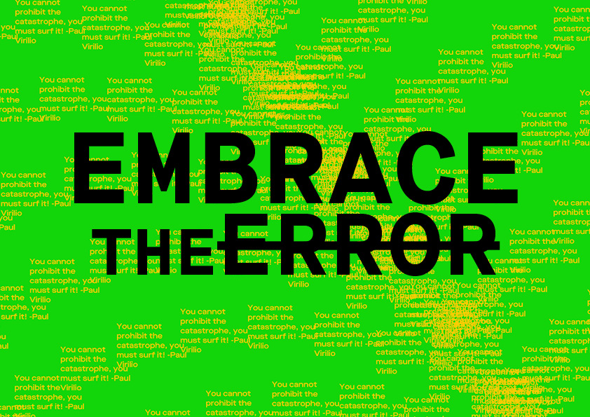

# EMBRACE THE ~~ERROR~~

[View work](https://samanthangsy.github.io/codewords/Final/EmbraceTheError/)

###### WRITE-UP:
EMBRACE THE ERROR takes you on a digital adventure through the words of philosophers, Walter Benjamin and Paul Virilio as quoted by Rosa Menkman in The Glitch Moment(um).

This book piqued my interest in spontaneity in the accident form and got me thinking of some questions. Are glitches just technological phenomena or are they social constructions reactive to technological expectations? Why is there always a negative connotation to ‘failing’, when we can in turn choose to embrace the ‘accidental potential’ of it. I feel this applies to everything in life and thus is why glitch theory speaks to me. 

Through this adventure, the reader is hopefully able to perceive glitches differently, where in the case of causing compromised readability, text is still readable thus still serving its purpose. The intention of this work lies within the process of coding it as well, which involved making mistakes crucial to producing the end product. 

Towards the end, the reader either continues to surf the catastrophe clicks repeatedly in search to fix or change the outcome. This leads to the screen freezing first before the text disappears, leaving a wash of flashing colours over the entire screen as the reader tries to navigate through it again. The system has however, broken and that marks the end of the adventure.

###### WARNING:
Stroboscopic visuals. Viewer discretion is advised.

###### TYPEFACE:
Maison Neue by Timo Gaessner released through Milieu Grotesque

###### AUDIO
gps jammer output by Kim Cascone*

*Kim Cascone is known for his paper The Aesthetics of Failure, which outlines the use of 				digital glitches and systemic failure in the creation of post-digital and laptop music.

##### [VIEW CODE](https://samanthangsy.github.io/codewords/Weekly%20Diary/02/)  |  [RETURN TO MAIN PAGE](https://samanthangsy.github.io/codewords/)
