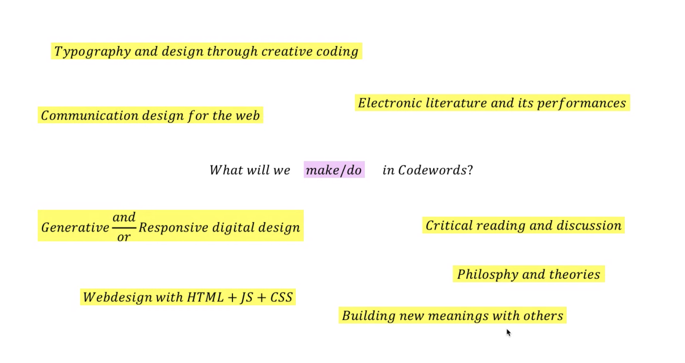

# WEEK 01
## "INTRODUCTION"

We began the first session of code+words with some introductions by Andy and Karen. We were given an overview of what to expect and the format of our class in the coming weeks. They brought up some work they had done in their practice and when The Library of Nonhuman Books was mentioned, I was reminded of how I had helped Karen out during Melbourne Art Book Fair on 14 March this year and that was when the COVID-19 situation was worsening in Melbourne. I still remember how Karen asked me if I was planning to head back home to Singapore and I was like nah I reckon I wouldn't, and exactly a week later on 21 March, I did :) CRAZY times it is and look where we're at now...attending class online...who knows when things will go back to normal...or is this the NEW normal. 

One thing that Andy mentioned stuck with me, and that was how with these online platforms on which we gather to attend class, we were on constant surveillance by the school. This was something I felt we should all be uncomfortable with. 

Andy invited us to interact and explore (virtual) Melbourne in Minecraft. Personally, I was amazed at the level of detail. I had heard of Minecraft and watched a couple short videos on it but I had never played it before so this was an experience for me. This was cool, but it did make me miss being back in Melbourne and attending class in Building 9. 

We also talked about reading in the digital age and touched on the prevalence of virtual gatherings/social events given the fact that we are currently experiencing this a global pandemic. One example that was mentioned was Travis Scott's Astronomical event on Fortnite. Andy likened Travis Scott's lyrics to poems and that made sense since rap is like poems. How different was live poetry to his concert on Fortnite then? 

This actually got me thinking of human adaptation and the shift from real life to virtual worlds through technological means. Yes, we may be spaced apart from one another but that does not mean that all interaction is gone. Obviously the level/type of interaction is different, but when we are in virtual worlds maybe where our looks/race/disabilities are hidden, some could find the quality of these interactions working better for them. 

### INTRO TO P5.JS 

In our first live coding session, we were introduced to the basics of Processing using p5.js, which was created by Lauren McCarthy. Karen taughts us how to set canvas sizes, apply colours, lines, shapes and some simple interactivity using mouse positions. To apply our newfound knowledge, we were individually tasked to create a sketches for our intials. 

Note to myself:

-Whatever is in setup runs right at the beginning 

-Whatever is in draw loops 30-60 frames per second

-Everything is measured in pixels (px)

### HOMEWORK
CREATE 2 SKETCHES FOR MY INTIALS 
TINKER AROUND!! 
MEET WITH GROUP MATES AT LEAST ONCE BEFORE NEXT LESSON

### NEW WORD LEARNT
Machinima

### LINKS TO LOOK AT
[Stelarc - Out Of Your Skin](https://www.youtube.com/watch?v=RSsmjcl-BjA)

[This is a Magazine](http://www.thisisamagazine.com/)

[Killbox](http://delappe.net/play/killbox/)

[Quake Friends](http://www.delappe.net/game-art/quakefriends/)

### MY INITIAL SKETCHES
view [S](https://samanthangsy.github.io/codewords/Weekly%Diary/01/S/)

view [N](https://samanthangsy.github.io/codewords/Weekly%Diary/01/N/)

##### [RETURN TO MAIN PAGE](https://samanthangsy.github.io/codewords/)  |  [NEXT WEEK](https://samanthangsy.github.io/codewords/Weekly%20Diary/02/)
