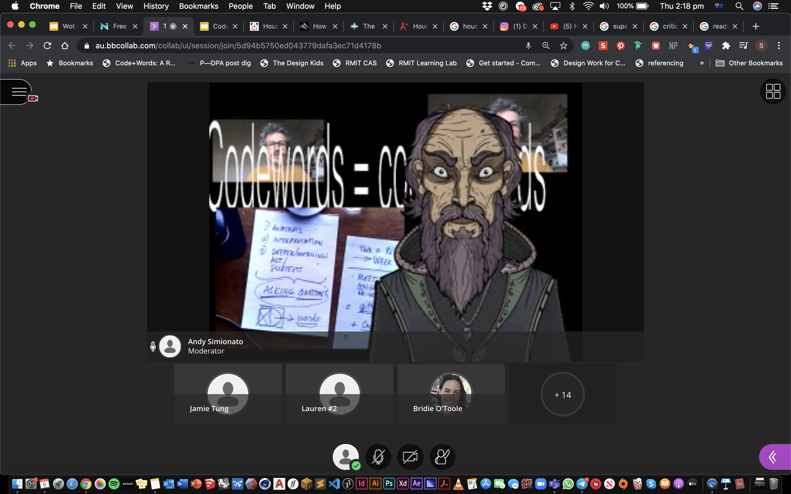
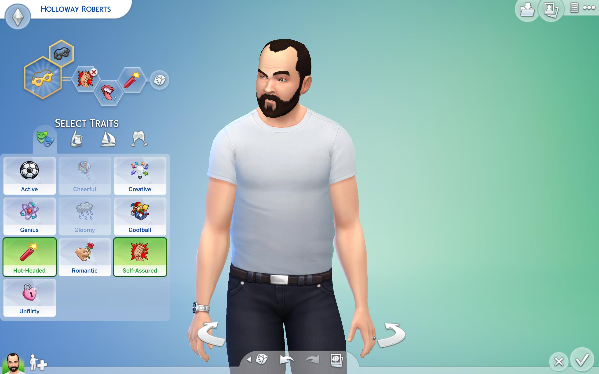

# WEEK 03

## "VIRTUAL"

This week, we looked at avataristic behavior and virtual identities. Andy was toggling between avatars to represent him speaking in class. I found it amusing yet fairly disturbing almost watching the avatars mimic his speech. 

We were introduced to artists such as Cindy Sherman, Stelarc and Mariko Mori. We also looked at things like AI dungeon and electronic literature. Gathering in small breakout groups, we researched e-lits and shared our findings [here](https://docs.google.com/presentation/d/1QXcxFkKdzMiwNWBSdXT0LG9YNFjlzViwScTtsLMXROo/edit#slide=id.g8e5317bdfc_0_20). 

Often times, design is not the main focus in e-lits and its all about the poetry generated through code. This is where designers can make a change and design it well. 

### SIMS x HOUSE OF LEAVES

Individually, we made a character on sims each. I chose to model Holloway Roberts as seen above. 

##### [PREVIOUS WEEK](https://samanthangsy.github.io/codewords/Weekly%20Diary/02/)  |  [NEXT WEEK](https://samanthangsy.github.io/codewords/Weekly%20Diary/04/)
