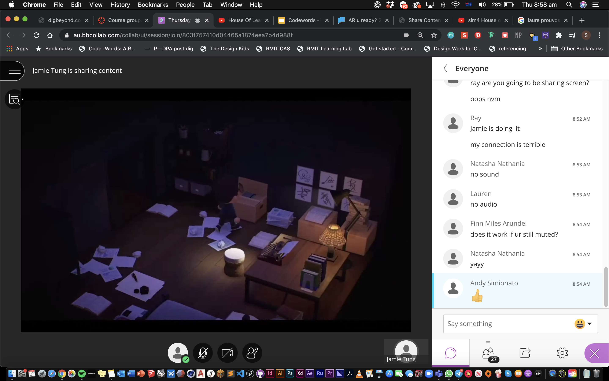
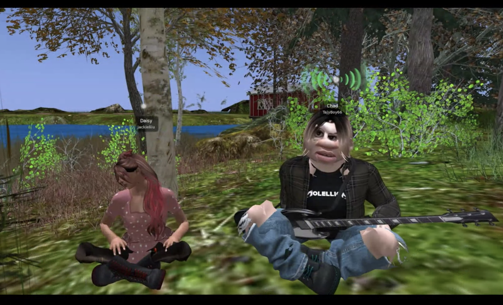
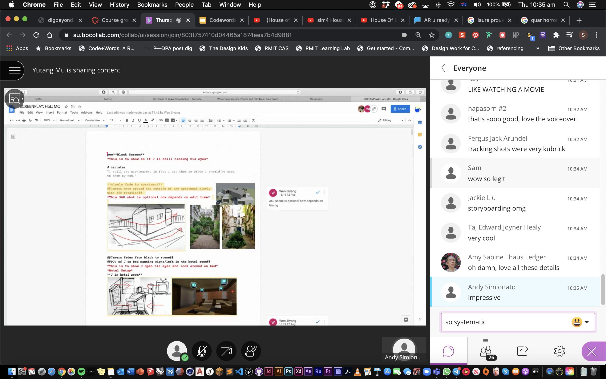

# Week 5 

## "SCREENING"

Today, we had a little viewing party of everyone's final cuts. Being able to watch the individual performances on various platforms one after another was really interesting. It was cool to see how my peers who had chosen environments like Club Penguin with limited control, had creatively managed to put on such a successful performative piece. kudos to them really. Those who had chosen envrironments with plenty of control too had made the most out of the tools, camera angles and customisations to create their video. I am honestly very impressed with everyone's work and especially in this time of studying remotely, group projects are quite the challenge in my opinion. 

### OUR WORK

For my group's work, we actually didn't manage to watch our clips pieced together until the screening session, so it was a surprise for all of us. Thankfully, it turned out fine.

- Documentary style with insertions of first person perspectives 
- In this chapter, Holloway and his team arrives at Navidson’s house and proceeds on a series of explorations. Struggles of male dominance and Navidson’s marriage with Karen falling apart is also evident. 
- Chose to Cut out Johnny's interjection and focus on the events within the house
- Read the passage as a team and decided on 15 scenes to focus on 
- 15 Scenes, 3 Scenes each 
- We made a character each and we’re using the house na created 
- Because Sims doesn’t allow us to collaborate live, we had to upload our creations onto a library and film individually 
- Kind of like an exquisite corpse where we didn’t see each others full work as we worked on our individual portions.
- At first we thought maybe we should be particular to keep the shooting styles consistent but later decided that we should embrace different shooting styles 

[FINAL CUT](https://www.youtube.com/watch?v=leyVlwvDqNM&feature=youtu.be)

### INTRO TO MAJOR PROJECT 

After lunch, Andy introduced us to the major project. It was time to focus on coding full on now. By next week, we would have to have selected and read through a piece of critical text from the [reader](http://digbeyond.com/readme/phplist.php?course=Code-Words) provided to us. 

##### [PREVIOUS WEEK](https://samanthangsy.github.io/codewords/Weekly%20Diary/04/)  |  [NEXT WEEK](https://samanthangsy.github.io/codewords/Weekly%20Diary/06/)

