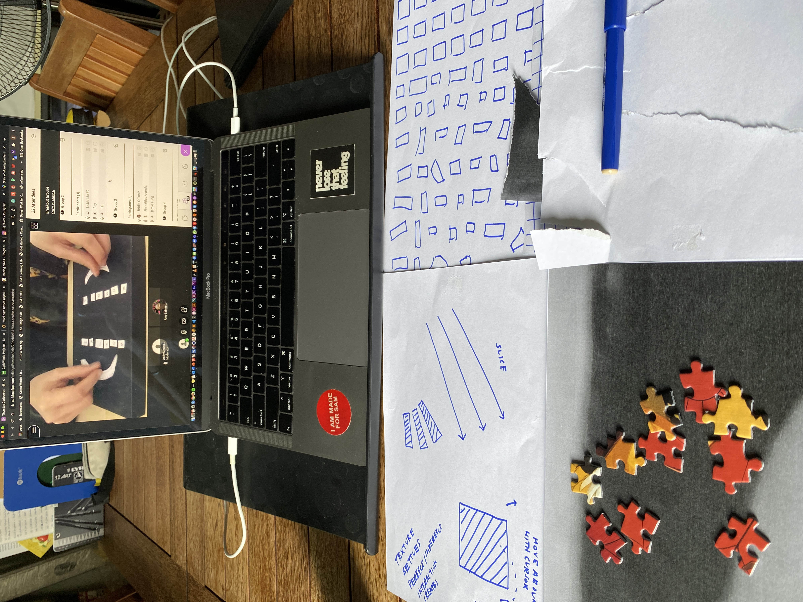

# WEEK 07

## "PROTOTYPE"

Back from a break I think we all needed. 

We shared prototypes we had created in smaller breakout groups first then to the entire class. It was nice to see people turn on their cameras and share their work, the closest we'd get to in class hands on sessions together. Got some helpful feedback from my peers but I'm not sure if I'm being too ambitious with mine. I mean, it's good to be but I need to think about the actual coding I will need to do to achieve these outcomes I'm envisioning. Then again, this is all part of the process of ideation right?

### CODING GYM 
Today's session involved adding sound to our sketches! Here is what we made: [sketch 1](https://samanthangsy.github.io/codewords/Weekly%20Diary/07/circle_and_sound_), [sketch 2](https://samanthangsy.github.io/codewords/Weekly%20Diary/07/soundtest) 

We also looked some p5.js libraries including [p5.play](https://molleindustria.github.io/p5.play/) which looks so fun and i'm just amazed at the possibilities with code. wow. 

Might look into putting sound into my piece on glitching. Could be an interesting addition to the project :) 

##### [PREVIOUS WEEK](https://samanthangsy.github.io/codewords/Weekly%20Diary/06/)  |  [NEXT WEEK](https://samanthangsy.github.io/codewords/Weekly%20Diary/08/)
