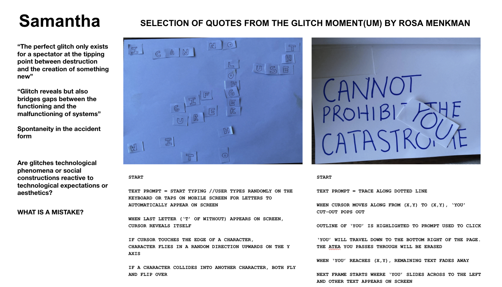

# WEEK 08

## "EXPLORATION"

### SHARING OUR PROTOTYPES

We got to share our paper prototypes in class today and try to start developing code for our project. Andy reminded us to start with one thing and get that right first before moving on to something else. I think more often than not, I try to do too many things at one go and get too overwhelmed and so this was an important reminder for me. 

### EXPLORING ANOTHER IDEA 

I keep going back to the text and get different ideas for my work. Here is one I want to explore.

NOTES ON NEW IDEA: 

- Basing my work off the context of how images consist of a string of text when you open it on textedit or notepad.

- Create a legend of some sort where every character represents a certain graphic (may be with specific x,y coordinates or not depending on how different the outcomes are).

- With either a press of spacebar or a click of a button, the viewer can toggle between text and graphic view of the quotes.

- Possibility for quotes to be jumbled on its own. Maybe even like a random walker so it just travels across the page

- Direct user interaction through being able editing the quotes (removing or adding letters, jumbling up the text etc)

- The new text layout will in turn produce a new visual layout. 

- Overlaid new visual on the original layout to show the glitch

### FEELING LOST

I had been talking to Michael, a friend who was in Karen's class Slave to the Algorithm and he was feeling lost with his project too. We had a nice chat discussing our works trying to help each other over messenger this week. Here's some snippets from our conversation. 

He shared some [inspiration]https://www.theartblog.org/2015/05/alphanumeric-systems-gone-awry-paul-chan-at-slought/ with me which he thought were similar to what I was thinking of, where letters were represented by graphics. 

I think I feel much better after the discussion. Back to the drawing board now! 

##### [PREVIOUS WEEK](https://samanthangsy.github.io/codewords/Weekly%20Diary/07/)  |  [NEXT WEEK](https://samanthangsy.github.io/codewords/Weekly%20Diary/09/)

