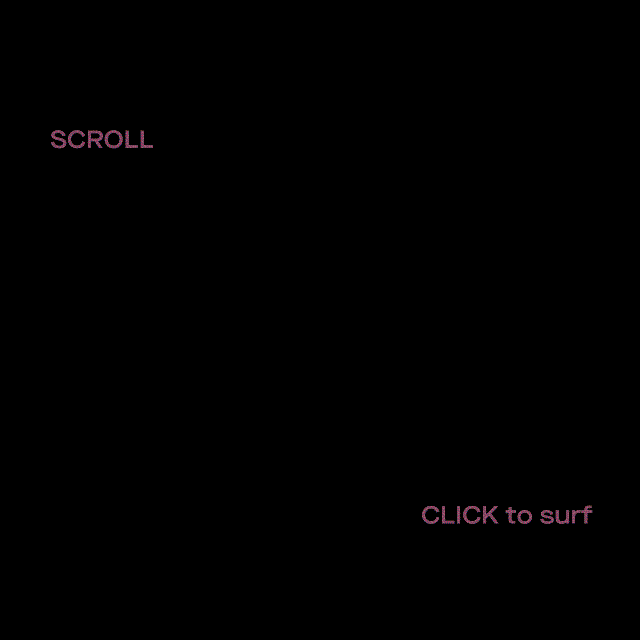
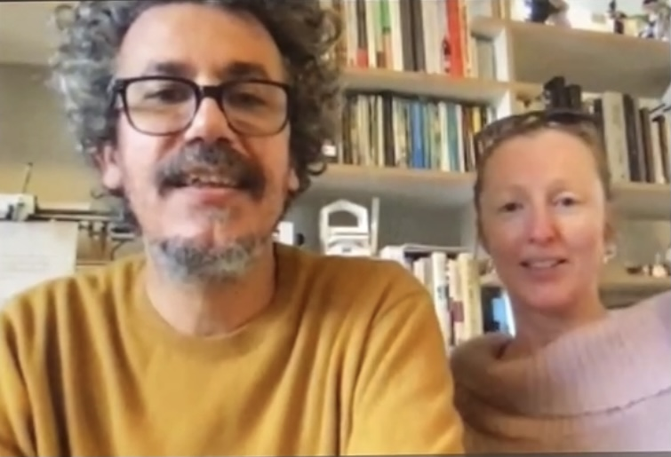

# WEEK 12

## "FAREWELL"

We dedicated this last session of Codewords to uploading out final projects onto Github and creating gifs for the showcase website. I didn't realise creating gifs would be so challenging but I guess it's all about getting used to it. Anyway, getting to see everyone's work on that single website that Karen painstakingly coded right before our eyes (WOW) was so cool. I WAS BLOWN AWAY......SUCH TALENT IN THE CLASS REALLY. I still do feel my work could be refined and further considered so I plan on working on it again when I have the time. Regardless, I'm still proud of what I have managed achieve having never touched javascript in my life just as I'm proud of my peers who similarly felt like they would struggle with code. 

#### EVERYTHING GOOD COMES TO AN END...BUT IT DOESN'T HAVE TO BE THE END
This studio was hands down my favourite this semester and what I would look forward to each week. It was always a nice way to end my school week. While we were taught so much in class, Andy and Karen never failed to make activities and discussions fun and engaging. Kicking off everything with a re-reading of House of Leaves was such an interesting primer for our major project. Really enjoyed that! It got me intrigued about the book too, so I purchased it mid way through the semester.

I also felt that this was the only class where us students were able to mingle (digitally) with one another on the regular. Though it was awkward discussing online in breakout sessions, I feel like we all got more used to it overtime. I also thought about how interesting it is that I would not have had the same conversations with my peers in real life because of our inhibitions. Through this class, I got to know Lauren we became friends. Funny how we knew of each other before, but never actually spoke to each other until everything shifted online. 

I'm glad to have taken this course because I have been struggling with figuring out what area of design I want to specialise in because though I like dabbling in many things, I would really want to develop my skills in one area that I am interested in and see where that takes me. Code has always been interesting to me, but I think what was holding me back was the fear within me. I was afraid of being terrible at it, when I should have just gone for it because it's okay to make mistakes and just learn along the way. 

Thanks to Andy and Karen, I feel motivated and inspired to learn more and practice writing code. I will definitely be incorporating coding into future projects of mine! 

<3

##### [PREVIOUS WEEK](https://samanthangsy.github.io/codewords/Weekly%20Diary/11/)  |  [EMBRACE THE ERROR](https://samanthangsy.github.io/codewords/Final/)
